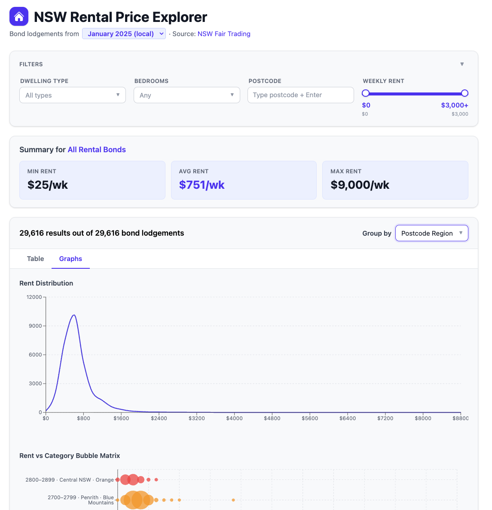

# NSW Rental Price Explorer

A single-page browser app for exploring NSW rental bond lodgement data published by NSW Fair Trading. Select a month, download the data, and filter or group it to understand rental prices across the state.

## What it does

- **Downloads data on demand** — fetches monthly XLSX files directly from NSW Fair Trading, parses them in the browser, and caches them locally as JSON files served by the dev server
- **Filters** by dwelling type (flat, house, terrace, room, etc.), number of bedrooms, specific postcodes, and weekly rent range
- **Summarises** the filtered dataset: minimum, average, and maximum weekly rent
- **Groups** results by dwelling type, bedrooms, or postcode, with per-group averages and medians
- **Sorts** by any column; paginated table view

Data covers monthly bond lodgements from January 2022 to the present (~30,000 records per month).

## Getting started

```bash
pnpm install
pnpm dev
```

Open [http://localhost:5173](http://localhost:5173), select a month from the dropdown, and click **Download**. The data is fetched, parsed, and saved locally — subsequent loads of the same month are instant.

## Scripts

| Command              | Description                                      |
| -------------------- | ------------------------------------------------ |
| `pnpm dev`           | Start the Vite dev server                        |
| `pnpm build`         | Production build to `dist/`                      |
| `pnpm preview`       | Preview the production build                     |
| `pnpm download-all`  | Download all months and write the manifest       |
| `pnpm cleanup`       | Kill any stale Vite processes on ports 5173–5178 |
| `pnpm clean`         | Remove downloaded data files and build output    |

> **Note:** Vite HMR doesn't work reliably on Google Drive-synced paths. After code changes, stop and restart the dev server (`pnpm cleanup && pnpm dev`).

## Deploying as a standalone static site

The app can be built into a fully self-contained static bundle with no backend or internet connection required at runtime.

### Step 1 — Download all data

```bash
pnpm download-all
```

This fetches every monthly XLSX from NSW Fair Trading (server-side, so no CORS restrictions apply), parses each file, and writes the results to `public/`:

- `public/rental-bonds-YYYY-MM.json` — one file per month
- `public/available-months.json` — manifest listing every successfully downloaded month key

Already-downloaded months are skipped automatically. Use `--force` to re-download everything.

### Step 2 — Commit the data files

The `public/` JSON files are intentionally tracked in git so the production build is fully reproducible from the repository alone.

```bash
git add public/
git commit -m "Update rental bond data"
```

### Step 3 — Build and deploy

```bash
pnpm build
```

Deploy the `dist/` folder to any static host (GitHub Pages, Netlify, Vercel, S3, etc.). No server is needed.

In production the app reads `available-months.json` on startup instead of probing for files, and only shows the months that were downloaded. The Download button is hidden — all data is already baked in.

### Updating data monthly

Re-run `pnpm download-all` (new months are added automatically as `MONTH_CATALOG` in `src/types.ts` is updated), commit, rebuild, and redeploy.

## Data source

[NSW Fair Trading — Rental Bond Lodgement Data](https://nsw.gov.au/housing-and-construction/rental-forms-surveys-and-data/rental-bond-data)

## Tech stack

React 19, TypeScript, Vite, Tailwind CSS v4

## Screenshot


